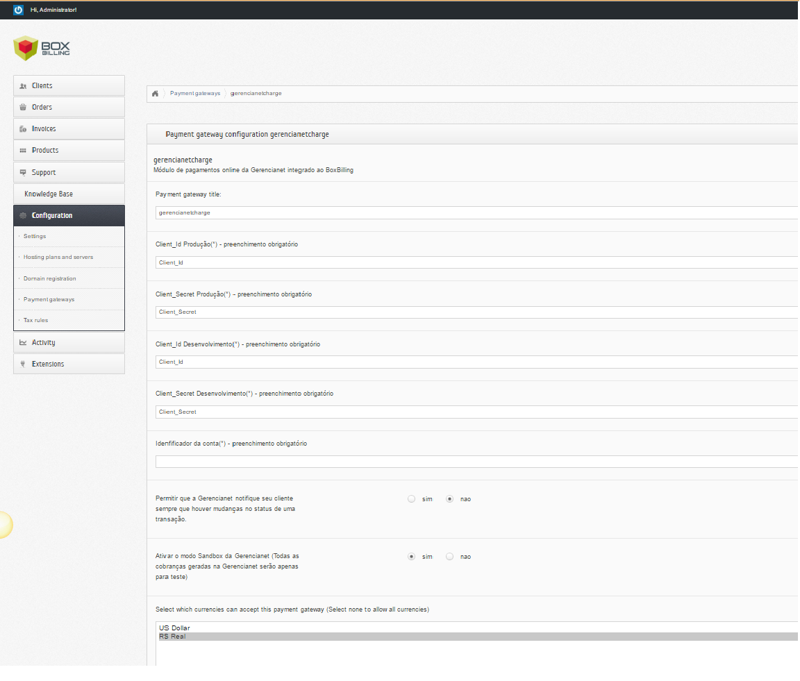

# Módulo de Integração Gerencianet para Boxbilling Oficial - Versão 0.1.0 (Beta) #

O módulo Gerencianet para o Boxbilling permite gerar boletos com registro por meio da nossa API.
Compatível com as versões superiores a versão 4.19 do Boxbilling.

Este é uma versão Beta do Módulo Oficial de integração fornecido pela [Gerencianet](https://gerencianet.com.br/) para Boxbilling. Com ele, o responsável pela conta Boxbilling pode receber pagamentos por boleto bancário e, assim que a cobrança tem uma confirmação de pagamento ou é cancelada, a Gerencianet envia uma notificação automática para o Boxbilling.

Caso você tenha alguma dúvida ou sugestão, entre em contato conosco pelo site [Gerencianet](https://gerencianet.com.br/).

## Instalação

1. Faça o download da última versão do módulo [aqui](https://codeload.github.com/gerencianet/gn-api-boxbilling/zip/master);
2. Descompacte o arquivo baixado;
3. Copie o arquivo gerencianetcharge.php e a pasta gerencianet_lib, disponíveis na pasta gn-api-boxbilling, para o diretório /bb-library/Payment/Adapter/ da instalação do Boxbilling;
4. Copie a imagem gerencianetcharge.png, disponível no diretório gn-api-boxbilling, para o diretório /bb-themes/huraga/assets/img/gateway_logos. 
5. No final do arquivo logos.css, localizado no diretório /bb-themes/huraga/assets/css/, cole o seguinte trecho de código:

```css
.logo-gerencianetcharge{
   background: transparent url("../img/gateway_logos/gerencianetcharge.png") no-repeat scroll 0% 0%;
    background-size: contain;
    width:135px;
    height: 25px;
    border: 0;
    margin: 10px;
}

```

Os arquivos do módulo Gerencianet devem seguir a seguinte estrutura no Boxbilling:

```
 /bb-library/Payment/Adapter/
  |  gerencianet_lib/
  |  gerencianetcharge.php
```

## Configuração do Módulo



Dentro do painel administrativo do Boxbilling, acesse o menu "Configuration" -> "Payment Gateways". Clique para editar as configurações do módulo "gerencianetcharge". A tela mostrada acima será exibida. Dentro do formulário, você deverá preencher os seguintes campos:

1. **Client_Id Produção:** Deve ser preenchido com o client_id de produção de sua conta Gerencianet. Este campo é obrigatório e pode ser encontrado no menu "API" -> "Minhas Aplicações". Em seguida, selecione sua aplicação criada, conforme é mostrado no [link](http://image.prntscr.com/image/7dc272063bb74dccba91739701a0478b.png);
2. **Client_Secret Produção:** Deve ser preenchido com o client_secret de produção de sua conta Gerencianet. Este campo é obrigatório e pode ser encontrado no menu "API" ->  "Minhas Aplicações". Em seguida, selecione sua aplicação criada, conforme é mostrado no [link](http://image.prntscr.com/image/7dc272063bb74dccba91739701a0478b.png);
3. **Client_Id Desenvolvimento:** Deve ser preenchido com o client_id de desenvolvimento de sua conta Gerencianet. Este campo é obrigatório e pode ser encontrado no menu "Nova API" -> "Minhas Aplicações". Em seguida, selecione sua aplicação criada, conforme é mostrado no [link](http://image.prntscr.com/image/447be4bc64644a35bcf5eaecd1125f5d.png);
4. **Client_Secret Desenvolvimento:** Deve ser preenchido com o client_secret de desenvolvimento de sua conta Gerencianet. Este campo é obrigatório e pode ser encontrado no menu "Nova API" -> "Minhas Aplicações". Em seguida, selecione sua aplicação criada, conforme é mostrado no [link](http://image.prntscr.com/image/447be4bc64644a35bcf5eaecd1125f5d.png);;
5. **Identificador da Conta:** Deve ser preenchido com o identificador de sua conta Gerencianet. Este campo é obrigatório e pode ser encontrado no menu "API", na tela principal e no canto superior esquerdo, conforme é mostrado no [link](http://image.prntscr.com/image/cabe13e1e5b64449b942cf31139150ba.png);
6. **E-mail de cobrança - Gerencianet:** Caso seja de seu interesse, habilite o envio de emails de cobrança da Gerencianet para o cliente final;
7. **Sandbox:** Caso seja de seu interesse, habilite o ambiente de testes da API Gerencianet;
8. **Moeda:** Escolha a opção R$ Real (A mesma deve estar definida no seu Boxbilling);
9. **Enabled:** Escolha a opção "Yes" para ativar o módulo da Gerencianet;
10. **Allow one time payments:** Marque a opção "yes";
11. **Allow subscription payments:** Marque a opção "No" (O módulo Gerencianet não suporta transações por assinatua);

Por fim, clique em "UPDATE".

#Erros Comuns de Integração:

A API Gerencianet poderá retornar erros referentes à geração da cobrança. Para mais informações sobre os códigos de erros retornados pela API Gerencianet, [clique aqui](https://docs.gerencianet.com.br/codigos-de-erros).

## Requisitos

* Versão mínima do PHP: 5.4.39
* Versão mínima do Boxbilling: 4.19


